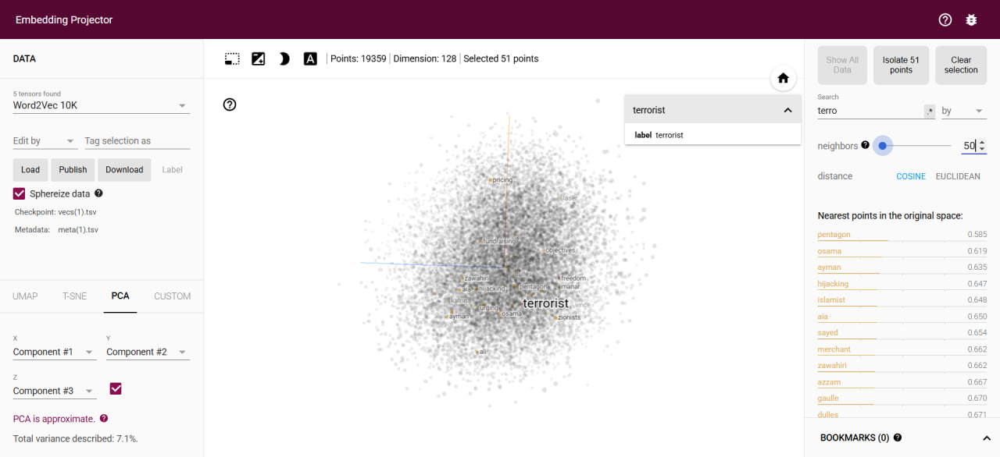

# Skip-Gram Word Embedding

Implementation of Word2Vec (Skip-Gram with Negative Sampling) from scratch using TensorFlow and Keras.

## Overview
This project trains word embeddings on the **text8** dataset (a cleaned subset of Wikipedia). It demonstrates the core mechanics of the Skip-Gram architecture where the model predicts context words given a target word.

## Features
- **Data Pipeline**: Robust preprocessing including stopwords removal, minimum frequency filtering, and subsampling of frequent words.
- **Skip-Gram**: Implementation of the skip-gram pair generation mechanism.
- **Negative Sampling**: Efficient training using negative examples.
- **Custom Model**: Subclassed `tf.keras.Model` for full control over the forward pass.
- **Visualization**: Helper code to export embeddings for the TensorFlow Projector.

## Usage
1. Open `SkipGram_Word_Embedding.ipynb`.
2. Run the cells to download data, preprocess, and train.
3. Use the generated `vecs.tsv` and `meta.tsv` to visualize results.

## Visualization Results
Below is a visualization of the learned word embeddings projected using PCA. The cluster highlights semantic relationships captured by the model (e.g., "terrorist" appearing close to "pentagon", "hijacking", and "islamist").

